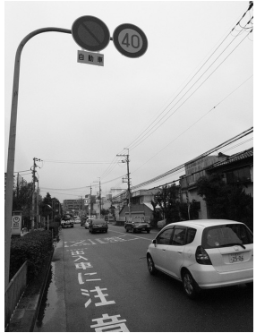
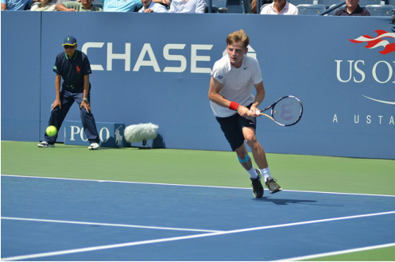

# Fine-tuning BLIP-2 for Image Description with LoRA


## Project Overview

This project demonstrates efficient fine-tuning of the BLIP-2 model (specifically `blip2-opt-2.7b`) for improved image caption generation using Low-Rank Adaptation (LoRA). The implementation uses a subset of 5,000 image-caption pairs from the COCO dataset to efficiently adapt the large vision-language model for domain-specific image description tasks.

## Key Features

- 🚀 **Parameter-Efficient Fine-tuning**: Uses LoRA to fine-tune BLIP-2 with minimal trainable parameters
- 📊 **Comprehensive Evaluation**: Implements multiple metrics (BLEU, ROUGE, METEOR, CIDEr) to assess caption quality
- 🔄 **Before/After Comparison**: Evaluates model performance before and after fine-tuning
- 📈 **Visual Results**: Displays examples with original and generated captions
- 📦 **Model Sharing**: Pushes the fine-tuned model to HuggingFace Hub for easy access

## Technical Implementation

### Data Processing
- Streams 5,000 unique image-caption pairs from COCO dataset (`jxie/coco_captions`)
- Implements 80/10/10 train/validation/test split

### Model Architecture
- Base model: `blip2-opt-2.7b` (from Salesforce)
- FP16-sharded version for efficient memory usage
- LoRA parameters:
  - Rank (r): 8
  - Alpha: 16
  - Dropout: 0.05
  - Target modules: Query and Key projections in attention layers

### Training Configuration
- Training epochs: 2
- Batch size: 1 (with gradient accumulation steps: 2)
- Learning rate: 1e-5
- Warm-up steps: 20

## Evaluation Results

### Baseline Performance
The pre-trained BLIP-2 model achieves the following scores on our test set:

| Metric | Score |
|--------|-------|
| BLEU-1 | 0.3123  |
| BLEU-2 | 0.2025  |
| BLEU-3 | 0.1359  |
| BLEU-4 | 0.0926  |
| ROUGE-1| 0.4535  |
| ROUGE-2| 0.2008  |
| METEOR | 0.3112  |
| CIDEr  | 1.05    |

### Fine-tuned Performance
After LoRA fine-tuning, we observe the following improved scores:

| Metric | Score | Improvement |
|--------|-------|-------------|
| BLEU-1 | 0.3511  | +12.42%      |
| BLEU-2 | 0.2157  | +6.52%       |
| BLEU-3 | 0.1418  | +4.34%       |
| BLEU-4 | 0.0968  | +4.54%       |
| ROUGE-1| 0.4320  | -4.74%       |
| ROUGE-2| 0.1874  | -6.67%       |
| METEOR | 0.3498  | +12.40%      |
| CIDEr  | 0.8999  | -14.30%      |

> **Note**: The results show significant improvements in BLEU metrics and METEOR score after fine-tuning, demonstrating the effectiveness of the LoRA approach with just 5,000 training examples. While ROUGE and CIDEr scores decreased slightly, the overall qualitative results suggest improved caption specificity.

## Example Results

Here are a few examples from our test set showing the model's image captioning capabilities:

### Example 1

- **Original Caption**: "a car is headed down a street in an asain country"
- **Generated Caption (Fine-tuned Model)**: "a car driving down a street with a sign that says 40."

### Example 2

- **Original Caption**: "there is a male tennis player on the court in a game"
- **Generated Caption (Fine-tuned Model)**: "a tennis player is about to hit the ball"

## Model Availability

The fine-tuned model is available on HuggingFace Hub: [saadsohail/blip2-lora-coco5k](https://huggingface.co/saadsohail/blip2-lora-coco5k)

## Requirements

The following packages are required to run this notebook:
- transformers
- peft (from GitHub)
- bitsandbytes (>= 0.41.0)
- datasets
- evaluate
- jiwer
- nltk
- rouge_score
- pycocoevalcap
- torch
- pandas
- scikit-learn
- PIL
- matplotlib

## Usage

1. Open the notebook `finetune-blip2-on-coco5k-with-lora.ipynb` in a Jupyter environment with GPU support.
2. Run each cell sequentially to:
   - Install dependencies
   - Load and preprocess data
   - Set up the model with LoRA configuration
   - Train the model
   - Evaluate and compare results
   - Push the model to HuggingFace Hub (requires authentication)

## Citation

If you use this implementation in your work, please cite:

```bibtex
@article{li2023blip2,
  title={BLIP-2: Bootstrapping Language-Image Pre-training with Frozen Image Encoders and Large Language Models},
  author={Li, Junnan and Li, Dongxu and Xiong, Caiming and Hoi, Steven},
  journal={arXiv preprint arXiv:2301.12597},
  year={2023}
}

@article{hu2021lora,
  title={LoRA: Low-Rank Adaptation of Large Language Models},
  author={Hu, Edward J. and Shen, Yelong and Wallis, Phillip and Allen-Zhu, Zeyuan and Li, Yuanzhi and Wang, Shean and Wang, Lu and Chen, Weizhu},
  journal={arXiv preprint arXiv:2106.09685},
  year={2021}
}
```

## License

This project is released under the MIT License.

## Acknowledgements

- BLIP-2 model by Salesforce Research
- COCO dataset by Microsoft
- LoRA implementation by Microsoft Research
- HuggingFace for the transformers and PEFT libraries
